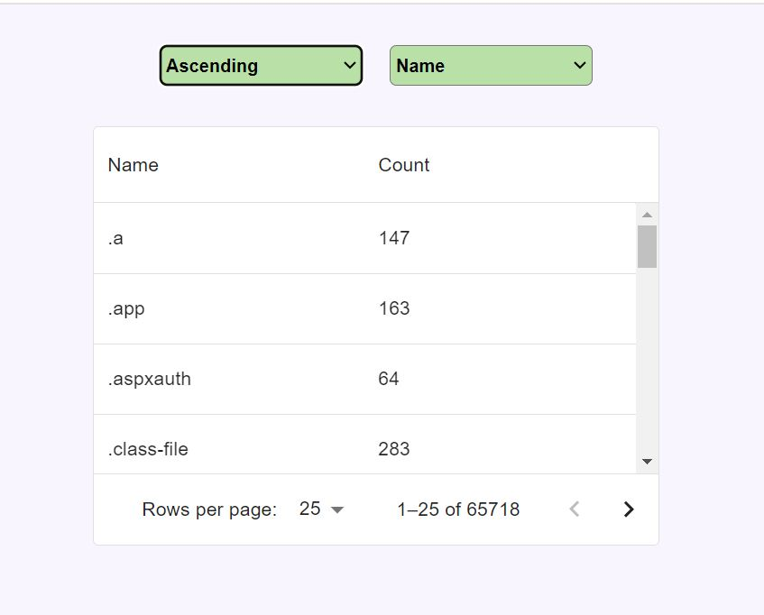

# Mediporta

## Overview

This is a React mini project completed as a part of the recruitment process.

## Table of Contents

- [Overview](#overview)
- [Demo and Screenshots](#demo-and-screenshots)
- [Technologies Used](#technologies-used)

## Demo and Screenshots

The [URL](https://mediporta-storybook.netlify.app/) of deployed application.

The application was deployed using Netlify.

## Technologies Used

- 
- 
- 
- 
- 
- 
-  

## License

N/A